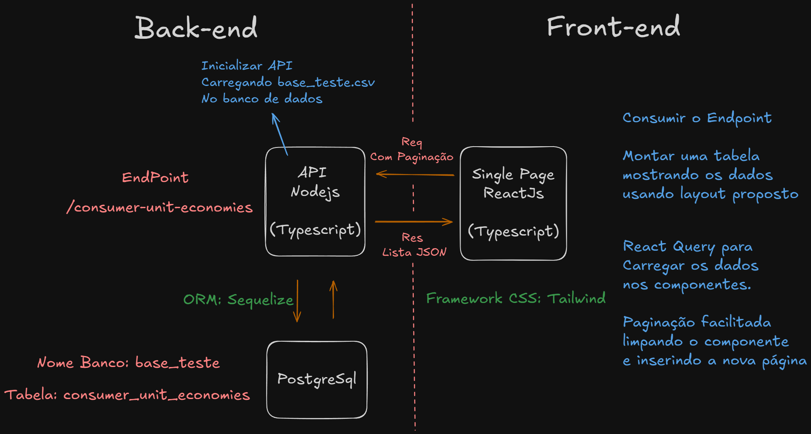

# Desafio Full Stack Nex Energy

## Feito por: Felipe Matheus Laskos

## Descrição do Projeto
Este projeto é uma aplicação **Full Stack** que lista a economia agrupada por unidade consumidora. Ele foi desenvolvido com **ReactJS no Frontend** e **Node.js no Backend** (ambos com Typescript), utilizando **PostgreSQL** como banco de dados, **Sequelize** como ORM para interagir com os dados e **Tailwind CSS** como framework CSS para estilização. Além disso, a API implementa **paginação**, e o Frontend gerencia isso com **React Query (`useQuery`) e `useState`**.

## Como rodar o projeto

- Clonar o repositório na máquina
- cd desafio-nex-energy
- cd nodejs e rode npm install
- cd reactjs e rode npm install
- Configurar o arquivo .env para conexão ao banco de dados. Na **raiz da pasta nodejs**, crie um arquivo chamado **`.env`** e adicione o seguinte conteúdo:

```.env
DB_USERNAME="insira o username do seu banco"
DB_PASSWORD="senha do banco"
DB_DATABASE="base_teste"
DB_HOST="127.0.0.1 ou localhotst
```

- cd em ambas as pastas e **npm run dev** para rodar nelas

- Acesse http://localhost:5173/ (Por favor, recarregue a página caso a estilização esteja bugada)

---

## Tecnologias Utilizadas
- **Banco de Dados:** PostgreSQL
- **Backend:** Node.js + Express + Sequelize
- **Frontend:** ReactJS + React Query
- **ORM:** Sequelize
- **Estilização:** Tailwind CSS
- **Linguagem:** TypeScript
- **Gerenciamento de Estado:** React Query (`useQuery`) e `useState`
- **Paginação:** Implementada na API e gerenciada no frontend

---

## Esquematização


## Estrutura do Banco de Dados
Nome do banco de dados: **base_teste**
A tabela **`consumer_unit_economies`** armazena os dados brutos provindos do arquivo **base_teste.csv**.

### **Tabela: `consumer_unit_economies`**
| Campo | Tipo de Dado | Descrição |
|--------|------------|------------|
| `id` | `BIGINT` | Identificador |
| `consumer_unit` | `BIGINT` | Número da unidade consumidora |
| `status` | `TEXT` | Status |
| `month_ref` | `DATE` | Mês de referência |
| `value` | `REAL` | Valor |
| `economy_value` | `REAL` | Valor economizado |
| `power_distribution_unit_bill_value` | `REAL` | Valor da conta da distribuidora |

---

## Backend

### **Importação dos Dados CSV**
Ocorre no inicio do NodeJS, assim que o servidor é aberto, utilizando a lib csv-parse.

### API
A API segue um padrão RESTful e fornece um endpoint principal para consulta dos dados paginados.

### **Busca todas as economias agrupadas por unidade consumidora**
- **Rota:** `GET /consumer-unit-economies`

### **Buscar Economia por Unidade Consumidora (com paginação)**
- **Rota:** `GET /consumer-unit-economies?page={page}&limit={limit}`
- **Descrição:** Retorna a economia agrupada por unidade consumidora, paginada.

---

## Frontend
O frontend foi construído utilizando o layout proposto como base com **ReactJS**, utilizando **React Query** (`useQuery`) para buscar os dados paginados. Além de utilizar Tailwind CSS como framework CSS para estilização..